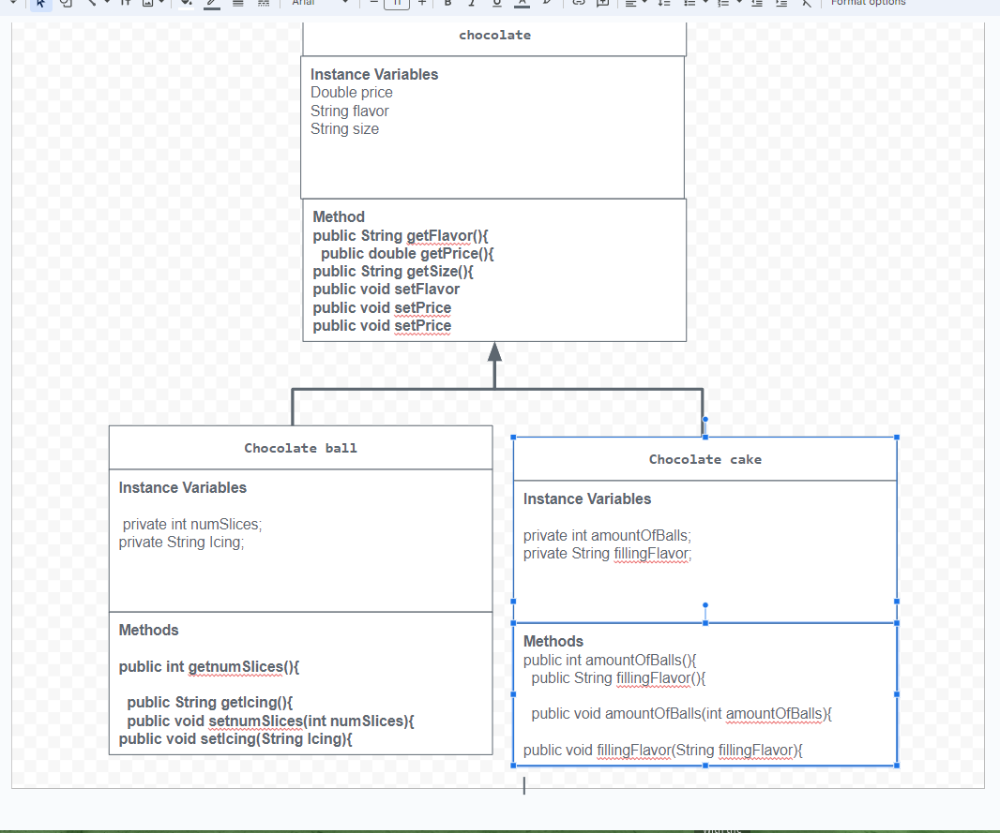

# Unit 2 - Store Management Project

## Introduction

You are opening a new business in your community! Businesses often need programs to manage the products and services they offer and track orders and requests from customers. Your goal is to create a store management system for your business.

## Requirements

Use your knowledge of object-oriented programming and class structure and design to create your store management system:
- **Create a class hierarchy** – Develop a superclass that represents a product or service your business offers and one or more subclasses that extend the superclass to represent more specific types of products or services.
- **Declare instance variables** – Declare instance variables in the superclass that are shared with the subclasses and instance variables in the subclasses that are not shared with the superclass.
- **Write constructors** – Write no-argument and parameterized constructors in the superclass and subclasses. Subclass constructors use the super keyword to call the superclass constructor.
- **Implement accessor and mutator methods** – Write accessor and mutator methods for instance variables that should be accessible and/or modifiable from outside of the class.
- **Implement a toString() method** – Write toString() methods in the superclass and subclasses that return information about the state of an object.

## UML Diagram

## Description
I made a chocolate store because I like eating chocolate and I thought it wouuld be a good store for this topic. I made a superclass of chocolate and I made 2 subclasses from it, chocolate cake and chocolate balls. I used  a no arguement constructors to give my chocolate the default value when being printed out which was a medium sized milk chocolate for 5$. I then used a parameterized constructor to directly assign the values  of the instance variables flavor, price and size. I used the accessor method to return the values. The mutator method i did in my code lets me change the value of the chocolate so for instance instead of it being the default values I can make the information for chocolate be a large dark chocolate and 6$.  My to string is to help the computer print out the method properly. 

